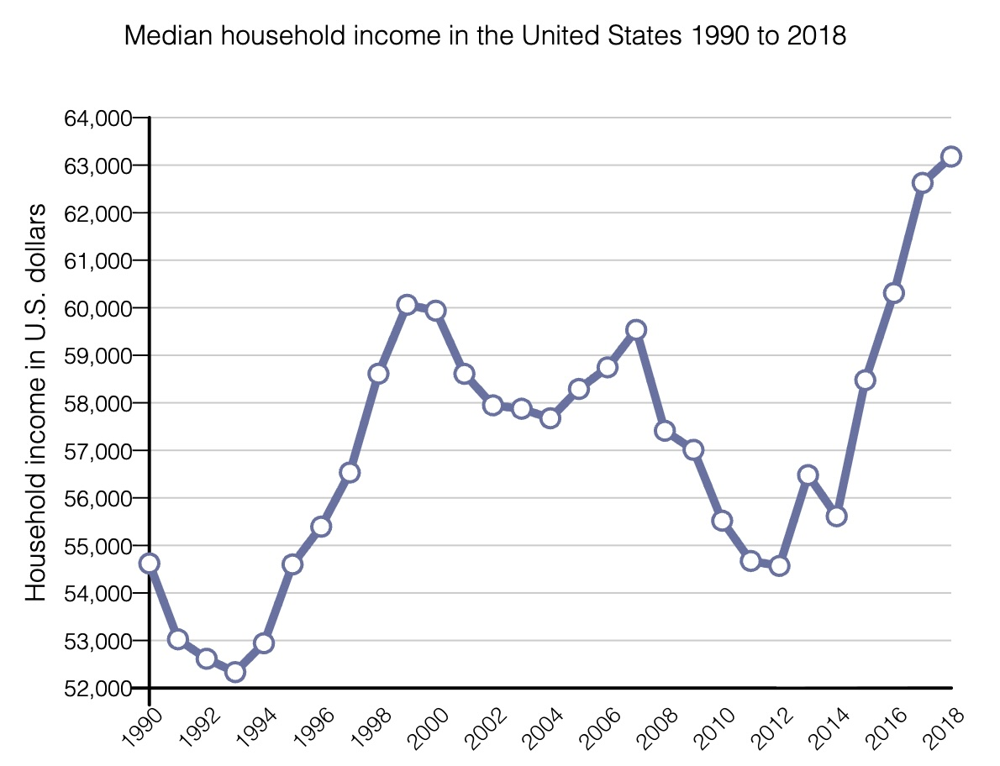
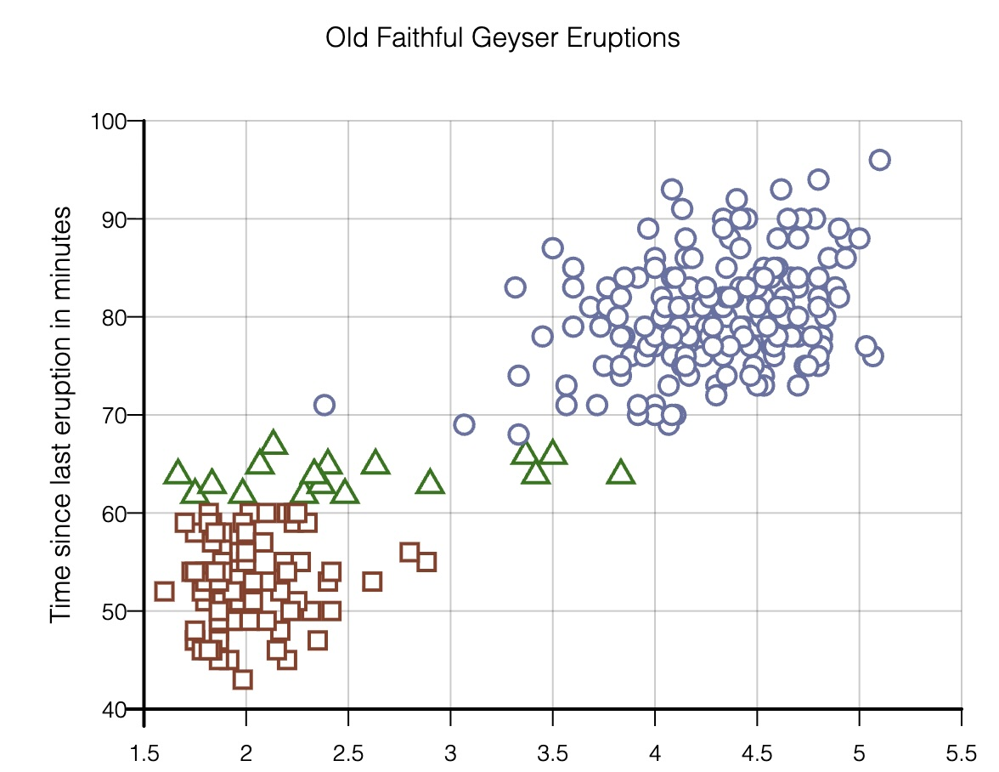
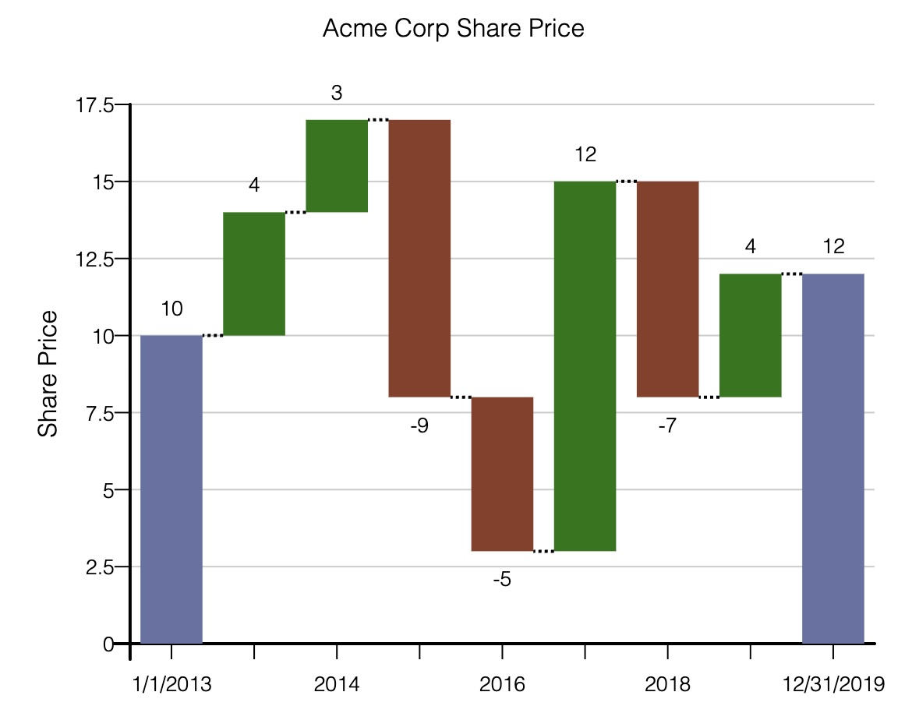
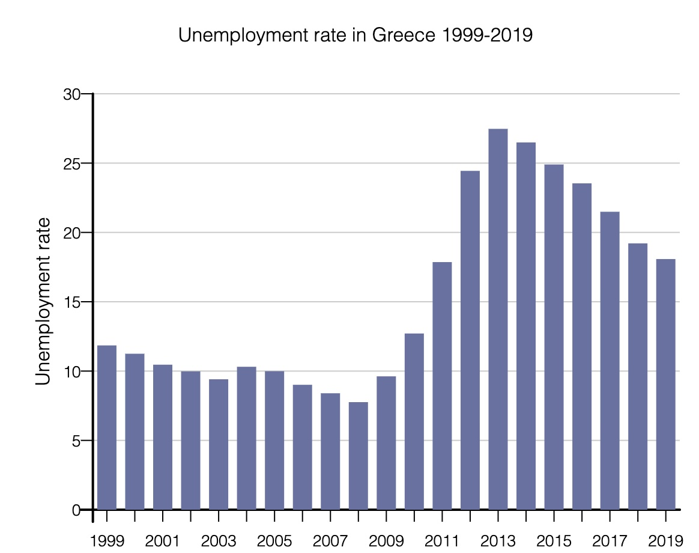
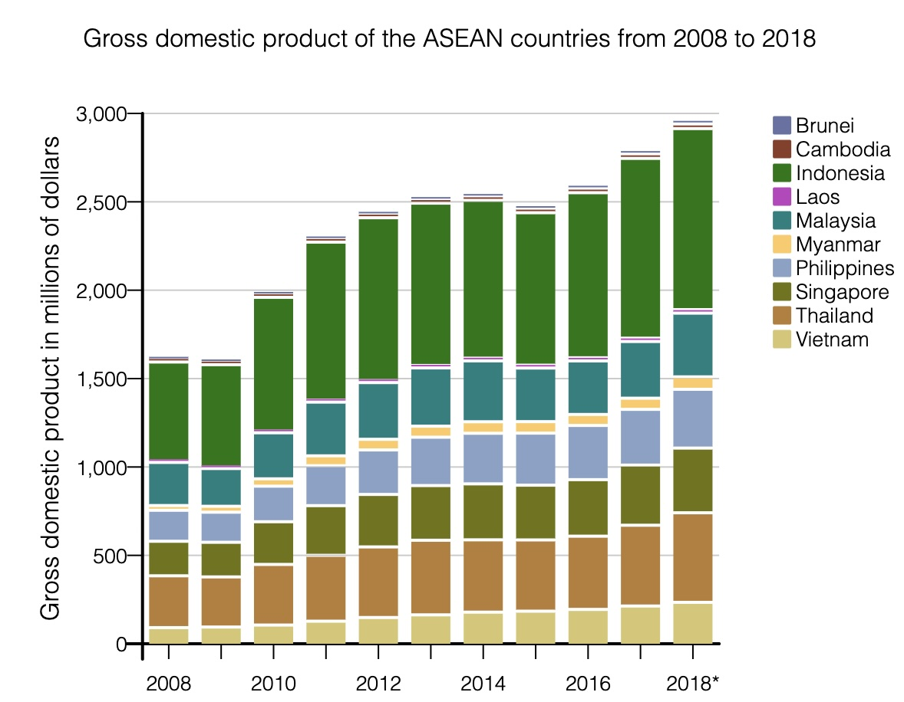
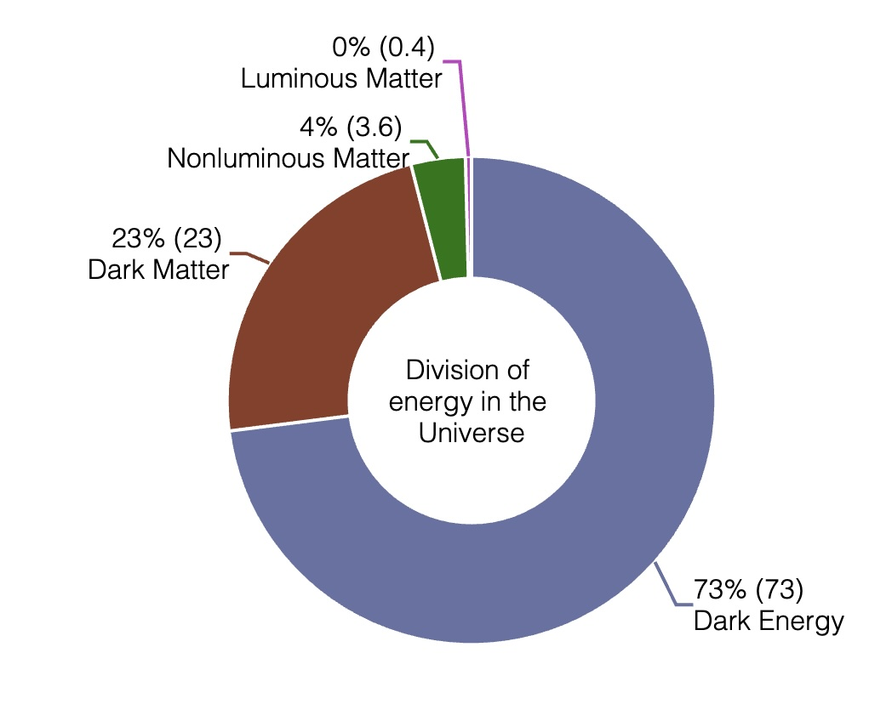

# ParaCharts automatic chart descriptions

Unmodified descriptions dynamically generated by ParaCharts, via our fully deterministic chart insight engine. Given the same data, the description will always be the same.

Note that the description formats and templates themselves are always a work in progress, and may improve over time, but the description engine is deterministic.

## Line

> This line chart shows the median household income in the United States over time from $54.621 thousand in 1990 to $63.179 thousand in 2018. The median household income has a rising trend, before falling and then rebounding back up. The median household income bottoms out at $52.334 thousand in 1993 and peaks at $63.179 thousand in 2018. The y-axis shows the household income in U.S. dollars. The x-axis shows the time in years. The chart has 29 records along the x-axis.

## Scatterplot

 

> This scatter plot compares the eruption duration time in minutes with the time since last eruption in minutes. The plot shows very strong positive correllation between the variables. The datapoints range from 1.6 to 5.1 along the x axis and from 43 to 96 along the y axis. The plot has 3 clusters with the largest containing 169 points.

## Waterfall

> This waterfall chart shows the share price of Acme Corp over time from $10 in 2013 to $12 in 2019, an increase of $2. The largest increase was $12 in 2017 and the largest decrease was $9 in 2015.

## Bar

 

> This bar chart shows the unemployment rate in Greece over time from almost 11.9% in 1999 to almost 18.1% in 2019. The unemployment rate slightly falls from 1999 to 2008, sharply rises to 2013, and then falls to 2019. The unemployment rate bottoms out at 7.76% in 2008 and peaks at almost 27.5% in 2013.

## Stacked Bar

 

> This bar chart compares the GDPs in different ASEAN nations over time from 2008 to 2018. The 10 segments of each bar show the GDPs in Brunei, Cambodia, Indonesia, Laos, Malaysia, Myanmar, Philippines, Singapore, Thailand, and Vietnam. The total GDP slightly rises from 2008 to 2018.

## Donut

 

> This donut chart shows the total distribution of the energy of the Universe. The largest slice is Dark Energy at 73% and the smallest slice is Luminous Matter at 0.4%.
